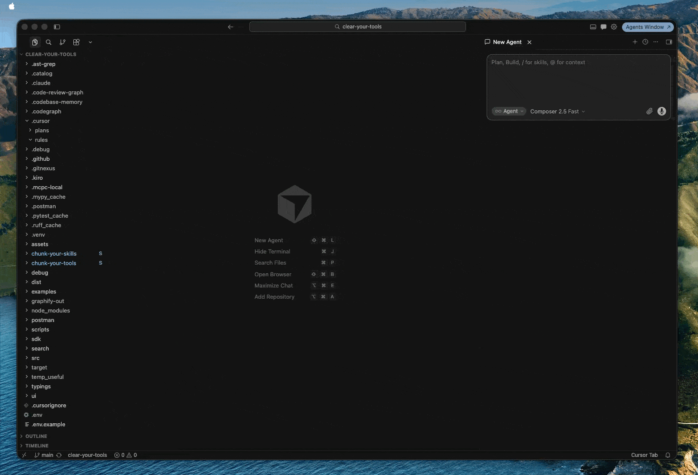

# Stop Drowning Your Cursor Agent in MCP Noise

Are you manually toggling MCP tools on and off? Typing *"use the XYZ tool"* to force skipping irrelevant
tools?
You're fighting a losing battle against context bloat—and paying for every wasted token.

## The Problem: Too Much Signal, Not Enough Relevance

Agent harnesses dump **every** MCP tool into the LLM context on **every** request. Even frontier
models suffer from information overload, hunting for needles in haystacks while your token bill grows.

Take Google Calendar's `events.list`: it exposes 20+ properties. For a simple prompt like *"When is
my first meeting tomorrow?"*, only 5 fields matter. The rest are schema noise that confuse the model
and burn context window.
See more tool examples in the [chunk-your-tools examples](https://github.com/qdrddr/chunk-your-tools/tree/main/examples).

Skills have the opposite problem. The agent sees only a short frontmatter description. Write it too
short, and the LLM misses it semantically. Write it too long, and you drown the context. Either way,
you end up manually adding and removing `SKILL.md` files mid-project.
See more skill examples in the [chunk-your-skills examples](https://github.com/qdrddr/chunk-your-skills/tree/main/examples).

## The Fix: CYT

**CYT** (`clear-your-tools`) automatically injects only the relevant context your agent needs, when
it needs it.

It works by **chunking** tools and skills into granular pieces, running them through a pruning
pipeline, and **recomposing** a "skinny" version:

- **Tools:** Drops irrelevant tools, optional properties, and enum values. Keeps schema intact.
- **Skills:** Decomposes markdown into semantic nodes (frontmatter, headers, prose), then restores
  only the relevant sections in their original hierarchy.

CYT uses three gating strategies—**BM25 lexical search**, **reranking**, and **LLM evaluation**—to
decide what survives without breaking JSON schema or markdown structure.

**Example:** A GitHub `create_issue` tool has properties `title` (required), `body`, and `labels`.
If your prompt doesn't need labeling, CYT drops `labels` entirely. The tool still validates; the LLM
just sees less noise.

## Why Cursor Needs MCPC + Hooks

Claude Code and Codex allow HTTP request interception via a reverse proxy. **Cursor does not**
(unless you BYOK). So CYT uses **hooks** instead.

Here's the problem: Cursor's `beforeSubmitProm` hook currently cannot mutate the tool list or add
direct context. Until it supports `additional_content`, we work around it by moving all content into
the `.cursor/rule/cyt-indexer.mdc` file that Cursor always reads.

Here's the catch with hooks: It does not allow manipulate tools in the agent; so we have to move them
out of Cursor and into an MCP aggregator.

**MCPC** is that aggregator. It hosts your servers; CYT dynamically exposes only the relevant
subset back to Cursor via project rules.

### Install & Configure (cyt-mcp — recommended)

Install [UV](https://docs.astral.sh/uv/getting-started/installation/), then:

```bash
uv tool install 'clear-your-tools[cyt-mcp]'
cyt hook cursor
```

The wizard migrates backend MCP servers to `~/.config/cyt/mcp/<agent>.json`, writes
`~/.config/cyt/mcp-aggregator.yaml`, and registers a single **cyt-mcp** entry in `~/.cursor/mcp.json`.
CYT injects full tool schemas via hooks while the agent sees minimal MCP stubs from cyt-mcp.

**Cursor MCP allowlist:** hooks can **deny** bad tool calls but returning `allow` does not bypass
Cursor's separate MCP approval UI. Add the `cyt-mcp` server (or individual stub tool names) under
**Settings → Tools & MCP → allowlist** to avoid per-call approval prompts.

**Legacy MCPC path** (optional): install `@apify/mcpc` and set `pruning.tools.hook.tools_from: [mcpc]`.

```bash
uv tool install 'clear-your-tools[all]'
npm install -g @apify/mcpc
cyt hook cursor
```

CYT will now create and update `.cursor/rules/cyt-indexer.mdc` automatically as you submit prompts,
injecting only the tool schemas and skill chunks relevant to your current intent.

<p align="center">
  
</p>

## What You Gain

- **~30% token reduction** on typical agent sessions.
- **Higher accuracy:** Less noise means fewer hallucinations and wrong tool picks.
- **Fewer steps:** No more "chicken-and-egg" discovery loops where the LLM can't choose a tool it
  hasn't seen.
- **Smart deduplication:** If a skill or tool is already exposed in the session, CYT won't re-inject
  it. If a skill's name + description is already strong enough, CYT gates itself to avoid
  double-spending context.

## Bonus: Skills over MCP

Stop copying `SKILL.md` files across projects. Host skills remotely and let CYT pull and prune them
on the fly:

```bash
mcpc connect https://mcp.skillsovermcp.com/mcp/upstash/context7 @context7-skill
cyt hook daemon restart
cyt hook cursor
```

## Dual-scope MCP (Global User + workspace)

One `cyt hook cursor` run from a repo configures **two** cyt-mcp servers in Cursor:

| Layer | Agent MCP file | Server defs | CYT config | Aggregator |
| --- | --- | --- | --- | --- |
| **Global User** | `~/.cursor/mcp.json` (`cyt-mcp`) | `~/.config/cyt/mcp/cursor.json` | `~/.config/cyt/config.yaml` | `~/.config/cyt/mcp-aggregator.yaml` |
| **Workspace-scoped** | `.cursor/mcp.json` (`cyt-mcp-workspace`) | `.cursor/cyt/mcp/cursor.json` | `.cursor/cyt/config/config.yaml` | `.cursor/cyt/config/mcp-aggregator.yaml` |

Hooks stay **global only** (`~/.cursor/hooks.json`). Workspace behavior uses hook payload `workspace_roots`:

- The hook daemon deep-merges `~/.config/cyt/config.yaml` with `.cursor/cyt/config/config.yaml` per request.
- Each live cyt-mcp instance (global + workspace, stdio or HTTP) **pushes** its tool catalog to the hook daemon via `POST /hook/catalog/register`. The daemon merges global + workspace registrations per hook request.

Remove workspace artifacts only:

```bash
cyt hook cursor --uninstall-workspace
```

Committing `.cursor/cyt/` is optional (the wizard does not edit `.gitignore`).

## MCP & skills permissions

Disable MCP servers/tools or skills without editing MCP JSON or moving `SKILL.md` files. Policy lives in cyt config only:

| Layer | Config path |
| --- | --- |
| **Global** | `~/.config/cyt/config.yaml` |
| **Workspace** | `.cursor/cyt/config/config.yaml` |

Example global policy:

```yaml
mcp:
  permissions:
    deny:
      - jcodemunch
      - fff/find_files
skills:
  permissions:
    deny:
      - noisy-skill
agents:
  cursor:
    mcp:
      permissions:
        deny: [gitnexus]
```

Effective deny lists are the **union** of global, `agents.<agent>`, and workspace layers (not deep-merged arrays).

```bash
cyt permissions show
cyt permissions mcp servers list
cyt permissions mcp servers disable jcodemunch --scope global --agent all
cyt permissions mcp tools disable fff/find_files --scope workspace
cyt permissions skills list
cyt permissions skills disable noisy-skill
cyt permissions export --format claude --output ~/.claude/settings.json
```

Use `--scope global|workspace` for writes, `--scope effective` (default) for list/show. After MCP changes, restart the agent or refresh cyt-mcp.

The legacy `enabled` key in `cyt/mcp/<agent>.json` is kept in sync for compatibility but is **not used at runtime** — only `config.yaml` permissions deny lists control which servers load. Wizard migration copies `enabled: false` entries into config deny automatically.

The same commands work via `cyt-mcp permissions ...`.

## Build Your Own

Want granular pruning in your own harness? The underlying chunkers are open-source (Apache 2.0) with
bindings for Python, TypeScript, C, Go, and natively in Rust:

```bash
cargo install chunk-your-tools
cargo install chunk-your-skills

# Test with CLI before embedding into your app
chunk-your-skills decompose --help
chunk-your-skills recompose --help

chunk-your-tools decompose --help
chunk-your-tools recompose --help
```

- **[`chunk-your-tools`](https://github.com/qdrddr/chunk-your-tools):** Decomposes tools into required properties,
  optional properties, and enums. Restores the shape based on the survivors.
- **[`chunk-your-skills`](https://github.com/qdrddr/chunk-your-skills):** Decomposes skills into frontmatter
  and markdown header nodes. Restores the SKILL file hierarchy, index, and structure.

Give the repos a star if you find them useful.

---

<details>
<summary><strong>FAQ</strong></summary>

**Why not just use progressive tool discovery?**
Discovery adds expensive reasoning steps, and the LLM still can't select a tool it has never seen.
CYT closes that gap by direct injection.

**Why MCPC specifically?**
It is reliable under heavy load where other aggregators flake or flap.

**What if Cursor adds `additional_content` support to hooks?**
CYT already implements it. The moment Cursor enables it, injection will work natively without the
MCPC workaround.

</details>

---

**Ready to cut the noise?**

```bash
uv tool install 'clear-your-tools[all]'
cyt hook cursor
```
