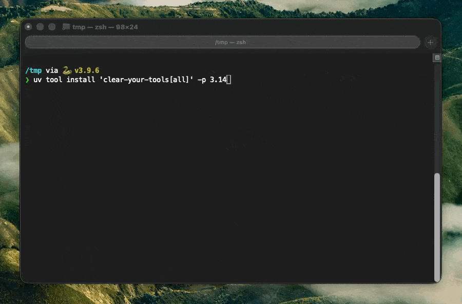

<!-- markdownlint-disable MD041 -->

# Clear Your Tools

<table border="0">
  <tr>
    <td valign="top" width="260">
      
    </td>
    <td valign="top">

Think token reduction is only about lowering costs by 30%?

- ⚡ Faster local & cloud LLMs: fewer tokens, less [Context Delusion](https://diffray.ai/blog/context-dilution/).
- 🎯 Better results: reduce [Context Rot](https://www.trychroma.com/research/context-rot), keep LLM focused on the task.
- 🧠 More context for you: less [Context Bloat](https://eval.16x.engineer/blog/llm-context-management-guide),
less memory compaction.

Your AI agent sees only the tools relevant to the current user task and intent.

✅ BM25 ranking by default
✅ No API keys required
✅ Works transparently

</td>
  </tr>
</table>

<!-- markdownlint-disable MD041 -->
<div align="center">

[![Quick Start][quick-start-shield]](#quick-start)
[![License][license-badge-shield]][license-link]
![No Telemetry][telemetry-shield]

[![version][version-shield]][release-link]
[![discord][discord-shield]][discord-link]
[![FOSSA Status][fossa-shield]][fossa-link]

![Shell][shell-shield]
![Python][python-tech-shield]
![TypeScript][typescript-shield]
![Rust][rust-tech-shield]
![Go][go-tech-shield]
![C][c-tech-shield]

  <table>
    <tr>
      <td align="center" width="240">
        <br/>
        <b>Claude Code</b>, <b>Claude Code Desktop</b>, <b>Claude Cowork</b>
      </td>
      <td align="center" width="240">
        <br/>
        <b>Codex</b>
      </td>
      <td align="center" width="240">
        <br/>
        <b>Cursor</b>
      </td>
    </tr>
  </table>

</div>
<!-- markdownlint-enable MD041 -->

**Clear Your Tools** is a reverse proxy for coding agents such as
[Claude Code](https://github.com/anthropics/claude-code), [Codex CLI](https://github.com/asadani/tool-attention/tree/main/examples/agents),
and [Cursor](https://cursor.com).

**The problem:**

- **[Context Rot](https://www.trychroma.com/research/context-rot):**
Model accuracy and reasoning degrade as input length grows,
even when task difficulty stays the same.
Removing irrelevant content consistently improves results.
- **[Context Dilution](https://diffray.ai/blog/context-dilution/):** On the NoLiMa benchmark, 11 of 12 models
fell below 50% of their short-context baseline at just 32K tokens.
- **[Context Bloat](https://eval.16x.engineer/blog/llm-context-management-guide):** Even frontier models lose recall and
reasoning quality as context grows into the 32-200K of tokens—and every extra token adds
API cost, because providers resend the full history on each turn.
- **Local inference:** Smaller inputs reduce memory pressure and speed up generation on self-hosted models.

Our Proxy sits between the agent and upstream
LLM providers (Anthropic-compatible APIs on OpenRouter, Novita, DeepInfra, and others), intercepts
each request, and shrinks the tool payload before forwarding it upstream. Can be easily adopted for
other harness agents.

Examples of how to run these agents with the proxy can be found in the [`./examples/agents`](./examples/agents) directory.

Large MCP catalogs can add tens of thousands of tokens of tool-schema overhead on every turn.
Clear Your Tools removes irrelevant tools and trims irrelevant optional parameters while always
keeping required fields for tools that stay in the request. Theory on [how it works](https://medium.com/qdrddr/217cc30d8f48).

---

## How it works

<p align="center">
  
</p>

```text
Agent (Claude Code, etc.)
        │
        ▼
Clear Your Tools proxy  ──► extract user query from messages
        │                   decompose each tool schema
        │                   score / filter with BM25 (default), rerank, or LLM pruning
        │                   recompose pruned tool list
        ▼
Upstream provider (OpenRouter, Anthropic, Novita, …)
```

On each intercepted request the proxy:

1. **Extracts the user query** from the conversation (latest user turn, with message cleanup).
2. **Decomposes tool schemas** into a catalog of chunks: each tool root keeps required properties;
   optional properties are split into separate searchable units.
3. **Runs the pruning pipeline** configured in `config.yaml`. Out of the box the default is
   **`bm25`** (local, no API keys). After `cyt setup`, choose between **`rerank`**
   (optionally followed by **`llm`**).
4. **Recomposes surviving tools** — required properties always remain; only optional properties
   that look relevant to the query are merged back in.
5. **Forwards the modified request** to the upstream provider with the smaller `tools` array.

<details>
<summary><strong>Pruning pipelines</strong></summary>

| Stage    | Model (default)                        | When it runs                                                                                                                     | What it does                                                                                                                       |
| -------- | -------------------------------------- | -------------------------------------------------------------------------------------------------------------------------------- | ---------------------------------------------------------------------------------------------------------------------------------- |
| `bm25`   | Local Tantivy BM25 (`cyt-indexer-sdk`) | Default pipeline; fallback when rerank/llm fail or tool count is low                                                             | Local catalog scoring; no API keys. Fingerprints cached under `~/.config/cyt/bm25/`.                                               |
| `rerank` | Qwen3-Reranker-8B (DeepInfra)          | ≥ `pruning.policy.minimum_tools` (default **50**), after `cyt setup`                                                             | Scores every catalog chunk against the user query; drops low-scoring tools and optional props.                                     |
| `llm`    | Mercury 2 or GPT-OSS-120B (OpenRouter) | ≥ `pruning.policy.minimum_tools` (default **50**), after `rerank`                                                                | LLM selects which catalog chunks to keep; can remove entire tools more aggressively.                                               |

**Tool Recommendations:**

- **Getting started / no setup** — the default **`bm25`** pipeline works out of the box with no
  remote API keys.
- **50+ tools** — run **`cyt setup`** and use **`rerank`** or **`llm`**. Rerank can be pipelined
  into LLM as a second stage (`pipeline: [rerank, llm]`) for stronger tool-level filtering on
  large catalogs.

**Pipeline & Model Recommendations**: Choose your pipeline based on model cost:

- **Expensive models** (≥$3/M input tokens, e.g. Sonnet): Use an **LLM pruner** pipeline.
- **Cheap models** ($0.10–$1/M input tokens, e.g. Haiku, Gemini 3 Flash): Use a **rerank** pipeline with a low-cost model.
- **Premium models** (e.g. Opus): Use an **LLM pruner + rerank** combined pipeline.

</details>

---

## Supported platforms

<div align="center">

[![Windows][windows-shield]](#supported-platforms)
[![macOS][macos-shield]](#supported-platforms)
[![Linux][linux-shield]](#supported-platforms)

</div>

Clear Your Tools and the `cyt-indexer` SDKs support **Windows**, **macOS**, and **Linux**.

<details>
<summary><strong>SDK & CLI</strong></summary>

All language bindings wrap the same Rust core: decompose tool schemas into searchable catalog
chunks, then recompose tools from a survivor list. See [cyt-indexer-cli.sh](./scripts/local/dev/cyt-indexer-cli.sh)
<!-- markdownlint-disable MD013 -->
<table border="0">
  <tr>
    <td valign="top">

**`clear-your-tools`** ([PyPI][pypi-cyt-link])
    </td>
    <td valign="top">

Python SDK (`import cyt`) and CLI (`cyt`: `proxy` / `pruners`)
    </td>
    <td valign="top">

[![PyPI clear-your-tools][pypi-cyt-version-shield]][pypi-cyt-link]

[![PyPI downloads][pypi-cyt-downloads-shield]][pypi-cyt-link]
    </td>
  </tr>
  <tr>
    <td valign="top">

**`cyt-indexer-sdk`** ([PyPI][pypi-sdk-link])
    </td>
    <td valign="top">

Python SDK (`cyt_indexer`)
    </td>
    <td valign="top">

[![PyPI cyt-indexer-sdk][pypi-sdk-version-shield]][pypi-sdk-link]

[![PyPI downloads][pypi-sdk-downloads-shield]][pypi-sdk-link]
    </td>
  </tr>
  <tr>
    <td valign="top">

**`cyt-indexer-sdk`** ([npm][npm-link])
    </td>
    <td valign="top">

TypeScript SDK
    </td>
    <td valign="top">

[![npm cyt-indexer-sdk][npm-sdk-version-shield]][npm-link]

[![npm downloads][npm-sdk-downloads-shield]][npm-link]
    </td>
  </tr>
  <tr>
    <td valign="top">

**`cyt-indexer`** ([crates.io][rust-link])
    </td>
    <td valign="top">

Rust library and CLI (`build` / `retrieve`)
    </td>
    <td valign="top">

[![crates.io cyt-indexer][rust-version-shield]][rust-link]

[![crates.io downloads][rust-downloads-shield]][rust-link]
    </td>
  </tr>
  <tr>
    <td valign="top">

**`libcyt_indexer`** ([sdk/c][c-link])
    </td>
    <td valign="top">

C library via CMake / `build-c-lib.sh`
    </td>
    <td valign="top">

[![GitHub sdk/c][c-version-shield]][c-link]
    </td>
  </tr>
  <tr>
    <td valign="top">

**`sdk/go`** ([pkg.go.dev][go-link])
    </td>
    <td valign="top">

Go SDK via cgo (`import cytindexer`)
    </td>
    <td valign="top">

[![pkg.go.dev sdk/go][go-version-shield]][go-link]
    </td>
  </tr>
</table>
<!-- markdownlint-disable MD013 -->
</details>

---

## Quick start

Requires uv tool.
Install [uv](https://docs.astral.sh/uv/getting-started/installation)

### 1. Install proxy

From PyPI (proxy + pruners):

```bash
uv tool install 'clear-your-tools[all]'
```

### 2. Launch an agent

One-command jump-start through the proxy:

```bash
cyt launch -- claude
cyt launch -- codex

# 3rd party providers
export ANTHROPIC_DEFAULT_HAIKU_MODEL="google/gemini-3.1-flash-lite"
export ANTHROPIC_AUTH_TOKEN="$OPENROUTER_API_KEY"
cyt launch --upstream https://openrouter.ai/api -- claude --model haiku
```

`cyt launch` shares the same upstream and credential bootstrap as `cyt proxy`, starts the proxy
if needed, prints a manual recipe to stderr (suppress with `--quiet`), then execs the agent.

For Codex, `cyt launch --configure -- codex` writes the managed provider block to
`~/.codex/config.toml`; `cyt launch --restore -- codex` removes it.

### 3. Inject relevant skills into the agnet

<details>
<summary><strong>Why inject skills?</strong></summary>

Agents always see a skill's header, but only read the body when they decide it's relevant. If your question fits the body but not the header, the agent may miss the skill — and you end up telling it to read the file yourself.

The `CYT` injects the matching parts of skills automatically — we call these **skinny skills**. See [SKINNY_SKILLS.md](SKINNY_SKILLS.md) for how it work.

If you prefer, you can use agent hooks instead; that path is separate from the proxy.

</details>

```bash
cyt hook all
```

### Cursor

Cursor has no reverse proxy — use hooks with MCPC instead. See [CURSOR-HOOK.md](CURSOR-HOOK.md).

### View pruning stats savings

```bash
cyt stats

# Optional (recommended):
cyt setup
cyt stats --add
```

Stats are stored in `~/.config/cyt/stats.db` by default.

<details>
<summary><strong>Run the proxy (optional)</strong></summary>

Installed CLI:

```bash
cyt proxy --upstream https://api.anthropic.com
# Or
cyt proxy --upstream https://api.openai.com

# 3rd party provider
cyt proxy --upstream https://openrouter.ai/api --upstream-kind anthropic
```

Canonical upstream URLs infer `--upstream-kind` automatically. For other providers (e.g. OpenRouter),
pass `--upstream-kind` explicitly.

Default listen port: **8834** (from bundled `defaults.yaml` or `~/.config/cyt/config.yaml`).

</details>

<details>
<summary><strong>Run the agent manually (optional)</strong></summary>

Point the agent at the proxy (default port **8834**). More examples are in
[./examples/agents](./examples/agents).

**Codex** (OpenAI Responses API via the proxy):

```bash
PORT=8834
codex \
    -c 'model_provider="cyt"' \
    -c 'model_providers.cyt.name="Clear-Your-Tools-Proxy/"' \
    -c "model_providers.cyt.base_url=\"http://127.0.0.1:${PORT}/openai/v1\"" \
    -c 'model_providers.cyt.wire_api="responses"'
```

**Claude Code** (Anthropic-compatible API):

```bash
PORT=8834
export ANTHROPIC_BASE_URL="http://localhost:${PORT}/anthropic"
claude
```

</details>

<details>
<summary><strong>Configure the proxy (optional)</strong></summary>

Interactive wizard (writes `~/.config/cyt/config.yaml` and optionally `~/.config/cyt/.env`):

```bash
cyt setup
```

Or edit `~/.config/cyt/config.yaml` manually — see [CONFIG.md](CONFIG.md).

Without `cyt setup`, the proxy uses the **default BM25 pipeline** — local pruning with no
remote API keys. Run `cyt setup` to configure rerank/llm pruners and full cost tracking.

</details>

---

## FAQ

<details>
<summary><strong>Doesn't pruning burn more tokens than it saves?</strong></summary>

The default is BM25 algorithm running locally on your computer it is free.
The reranker and weak LLM used for pruning are **much cheaper per token** than the main model
(e.g. Claude Sonnet). You may spend extra tokens on pruning, but they cost a fraction of what you
save on the main request. Set `input_cost_per_token` and `output_cost_per_token` in
[`~/.config/cyt/config.yaml`](CONFIG.md#configuration) to track savings.

**Example pricing (input tokens):**

| Model               | Cost per 1M input tokens |
| ------------------- | ------------------------ |
| Claude Sonnet 4.6   | $3.00                    |
| Qwen-Reranker-8B    | $0.050                   |
| GPT-OSS-120B        | $0.14                    |
| Inception Mercury 2 | $0.25                    |

The weak models such as Mercury 2 or GPT-OSS-120B returns only the IDs of tools to keep, so its
output stays extremely small. Rerankers do not count output tokens and are usually much cheaper
than a strong LLM.

**Rule of thumb:** saving 1M Sonnet input tokens is still worthwhile even if pruning uses up to
~10M Mercury tokens — roughly a 1:10 cost ratio. The reranker has roughly a 1:60 cost ratio.

In practice, pruning usually adds modest overhead. Worst case (no tools pruned), you might pay
~$3.30 instead of $3.00. With typical pruning (40–95% of tool tokens removed), tool-schema cost
drops from ~$3.00 to roughly **$0.15–$1.80**, plus ~$0.30 for pruning — about **$0.45–$2.10 total**
for tool-related cost, or roughly **30–85% savings** depending on policy.
</details>

<details>
<summary><strong>Why don't I see 30–85% savings on my total request?</strong></summary>

1. Those numbers apply to **tool schemas only** of the **input tokens only**, not the full prompt (system message, conversation
history, user message, etc.).
2. Clear Your Tools prunes tools based on the user request; the rest of
the request is unchanged. Codex agent has an efficient tool use and CYT saves less tokens.
3. Skills injection is disabled by default. To enable it, run `cyt setup` or set `skills.enabled: true` in `~/.config/cyt/config.yaml`
4. If you have **no MCP tools** and only the agent's **built-in system tools**, there is less to
   prune — expect **lower overall savings**, typically around **10–20%**.

How much you save overall depends on:

- **How many tools you have** — more MCP servers mean a larger share of the request is tool
  schemas. We do not recommend using CYT below 50 tools.
- **Which pruning policy you use** — see [Pruning policies](CONFIG.md#configuration).

To estimate savings on a captured request JSON, see [`DEV.md`](DEV.md).
To see statistics of actual net savings (input tokens) run:

```bash
cyt stats
```

With ~100 tools and `prune_all`, expect **~85–95% savings on tool tokens** and typically **~30%+
savings on the full request**. The more tools you have the more overall savings you'll see.

</details>

<details>
<summary><strong>Where can I see how many tools and parameters an MCP server has?</strong></summary>

The popular [Fetch](https://mcpmarket.com/server/fetch) MCP server is a good example. On its
**Tools** tab: 4 tools, each with 4 parameters (1 required, 3 optional) — 16 parameters total.

If the user asks to "fetch the Markdown of a webpage", the `prune_all` typically keeps only the
**Fetch Markdown** tool with its required parameter plus any optional parameters that look
relevant. Unrelated tools (e.g. **Read file**) are dropped entirely.

</details>

<details>
<summary><strong>Is my provider/model supported?</strong></summary>

CYT's **pruner models** (the cheap reranker and LLM that decide which tools to keep) call providers through [LiteLLM](https://docs.litellm.ai/docs/providers).
If LiteLLM supports your provider and model, you can use them in CYT.

When you run `cyt setup` and add a pruner model, you'll be prompted for:

- **Provider** — LiteLLM provider route, without a trailing slash (e.g. `openai`, `openrouter`).
- **Model name** — LiteLLM model string (see the [provider docs](https://docs.litellm.ai/docs/providers)).
- **API key env var** — the *name* of the environment variable that holds your key,
not the key itself (e.g. `OPENAI_API_KEY`, `OPENROUTER_API_KEY`).
- **domain_match** — hostname from the provider's API base URL (e.g. `openai.com` for OpenAI, `openrouter.ai` for OpenRouter).
Used to match outgoing requests to the right model config.

</details>

<details>
<summary><strong>Claude Code reports ZlibError when using the proxy</strong></summary>

Install missing zlib:

```bash
npm install -g zlib
brew install zlib
```

This usually means the proxy returned a **`Content-Encoding: gzip`** (or `deflate`) header with a body
that was **already decompressed**. Claude Code’s `fetch` then tries to inflate plain JSON/SSE and fails.
It is **not** a missing zlib install on your machine or in CYT.

**Fix:** upgrade to a `cyt` build that streams upstream bytes unchanged (`aiter_raw` pass-through).
After upgrading, verify:

```bash
curl --raw -sS -D - -o /tmp/cyt-msg.body \
  -H 'Accept-Encoding: gzip' \
  ... # your POST to http://127.0.0.1:8834/anthropic/v1/messages
head -c 4 /tmp/cyt-msg.body | xxd   # should show 1f8b when header says gzip
```

**Also check:** `ANTHROPIC_BASE_URL` must use **`http://`** for the default plain-HTTP server,
e.g. `http://localhost:8834/anthropic`. Using **`https://`** against `cyt proxy` (without TLS/`http2.serve`)
causes uvicorn’s `Invalid HTTP request received` and broken API calls.

</details>

<details>
<summary><strong>Uvicorn logs Invalid HTTP request received</strong></summary>

`cyt proxy` listens for **HTTP/1.1** on the configured port (default **8834**).
This warning almost always means a client connected with the wrong protocol:

- **`https://localhost:8834`** while the proxy is plain HTTP → TLS handshake bytes, not HTTP
- HTTP/2 prior knowledge to uvicorn (use `http2.serve` + TLS certs only if you intend HTTPS)

Use `http://localhost:8834/anthropic` unless you have enabled Hypercorn TLS in config.

</details>

<details>
<summary><strong>Should I use .env</strong></summary>

We strongly recommend storing API keys via `cyt setup` (uses the macOS Keychain **cyt** service through the Python keyring backend). Shell exports and `~/.config/cyt/.env` also work.

```bash
cyt setup   # interactive; stores keys in Keychain service "cyt"

# Optional: inspect or seed Keychain manually (service must be "cyt", not a custom name)
security find-generic-password -s "cyt" -a "__credentials__" -w
```

</details>

---

## Development

See [`DEV.md`](DEV.md) for checkout setup, repository layout, library usage, and configuration reference.

---

## Limitations

See [`LIMITATIONS.md`](LIMITATIONS.md) for deployment constraints, token accounting caveats, and MCP aggregator trade-offs.

## Debug

See details to debug pruning in [debug/](debug/).

---

## License

<details>
<summary><strong>Inspiration</strong></summary>

This project is inspired by the ideas explored in the [tool-attention](https://github.com/asadani/tool-attention) project,
particularly around improving tool selection efficiency and reducing unnecessary tool exposure to the model.

It also aims to limit the effects of [context rot](https://www.trychroma.com/research/context-rot)
by pruning irrelevant or confusing tools from the available toolset based on the current user prompt and execution context.

Reducing irrelevant tools helps decrease prompt noise, lowers cognitive load on the model,
and can improve tool selection accuracy and overall agent reliability.

</details>

See [`LICENSE`](LICENSE).

[quick-start-shield]: https://img.shields.io/badge/Quick_Start-5_min-blue?style=for-the-badge
[license-badge-shield]: https://img.shields.io/badge/License-Apache_2.0-yellow?style=for-the-badge
[version-shield]: https://img.shields.io/github/v/release/qdrddr/clear-your-tools?style=flat-square&label=version&color=4385BE&logoColor=white
[release-link]: https://github.com/qdrddr/clear-your-tools/releases
[npm-sdk-version-shield]: https://img.shields.io/npm/v/cyt-indexer-sdk?logo=npm&color=3178C6&logoColor=white
[npm-sdk-downloads-shield]: https://img.shields.io/npm/dm/cyt-indexer-sdk?logo=npm&color=3178C6&logoColor=white
[npm-link]: https://www.npmjs.com/package/cyt-indexer-sdk
[pypi-cyt-version-shield]: https://img.shields.io/pypi/v/clear-your-tools?logo=pypi&logoColor=white&color=2E8B57
[pypi-cyt-downloads-shield]: https://img.shields.io/pypi/dm/clear-your-tools?logo=pypi&logoColor=white&color=2E8B57
[pypi-cyt-link]: https://pypi.org/project/clear-your-tools/
[pypi-sdk-version-shield]: https://img.shields.io/pypi/v/cyt-indexer-sdk?logo=pypi&logoColor=white&color=4EAA25
[pypi-sdk-downloads-shield]: https://img.shields.io/pypi/dm/cyt-indexer-sdk?logo=pypi&logoColor=white&color=4EAA25
[pypi-sdk-link]: https://pypi.org/project/cyt-indexer-sdk/
[rust-version-shield]: https://img.shields.io/crates/v/cyt-indexer?logo=rust&color=e6522c&logoColor=white
[rust-downloads-shield]: https://img.shields.io/crates/d/cyt-indexer?logo=rust&color=e6522c&logoColor=white
[rust-link]: https://crates.io/crates/cyt-indexer
[c-version-shield]: https://img.shields.io/github/v/release/qdrddr/clear-your-tools?style=flat-square&label=sdk%2Fc&color=555&logoColor=white
[c-link]: https://github.com/qdrddr/clear-your-tools/tree/main/sdk/c
[go-version-shield]: https://pkg.go.dev/badge/github.com/qdrddr/clear-your-tools/sdk/go
[go-link]: https://pkg.go.dev/github.com/qdrddr/clear-your-tools/sdk/go
[shell-shield]: https://img.shields.io/badge/-Shell-4EAA25?logo=gnu-bash&logoColor=white
[python-tech-shield]: https://img.shields.io/badge/-Python-3776AB?logo=python&logoColor=white
[typescript-shield]: https://img.shields.io/badge/-TypeScript-3178C6?logo=typescript&logoColor=white
[rust-tech-shield]: https://img.shields.io/badge/-Rust-3776AB?logo=rust&logoColor=white
[windows-shield]: https://img.shields.io/badge/Windows-supported-0078D6?logo=windows&logoColor=white
[macos-shield]: https://img.shields.io/badge/macOS-supported-000000?logo=apple&logoColor=white
[linux-shield]: https://img.shields.io/badge/Linux-supported-FCC624?logo=linux&logoColor=black
[license-link]: LICENSE
[telemetry-shield]: https://img.shields.io/badge/No_Telemetry-none-green?style=for-the-badge
[discord-shield]: https://img.shields.io/badge/Discord-Join-5865F2?logo=discord&logoColor=white
[discord-link]: https://discord.com/invite/FhACaAAW9C
[fossa-shield]: https://app.fossa.com/api/projects/git%2Bgithub.com%2Fqdrddr%2Fclear-your-tools.svg?type=shield&issueType=security
[fossa-link]: https://app.fossa.com/projects/git%2Bgithub.com%2Fqdrddr%2Fclear-your-tools?ref=badge_shield&issueType=security
[c-tech-shield]: https://img.shields.io/badge/-C-A8B9CC?logo=c&logoColor=white
[go-tech-shield]: https://img.shields.io/badge/-Go-00ADD8?logo=go&logoColor=white
